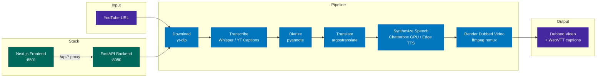

# Foreign Whispers

[](./LICENSE)

> **NYU Spring 2026 — NLP Project**  
>| **Student** | **NetID:** |
>|---|---|
>| Tilak Bhansali | tb3525 |
>| Advait Jishnani | aj4700 |

YouTube video dubbing pipeline — transcribe, translate, and dub videos into Spanish with gender-aware neural voices.

---

## 🎬 Demo

| | Link |
|---|---|
| **Screen Recording (Pipeline Demo)** | _TODO: Add YouTube/GDrive link_ |
| **Sample Output Video** | _TODO: Add YouTube/GDrive link_ |

---

## Architecture



---

## Quick Start

### Mac (Apple Silicon / Intel) — CPU Profile

```bash
git clone https://github.com/tilak30/foreign-whispers.git
cd foreign-whispers

# Copy env template (no changes needed for basic use)
cp .env.example .env

# Required by yt-dlp
touch cookies.txt

# Start all services (no GPU required)
docker compose --profile cpu up -d

# Open the UI
open http://localhost:8501
```

TTS uses **Microsoft Edge TTS** (free, neural, gender-aware) by default — no GPU or API key needed.

### NVIDIA GPU

```bash
docker compose --profile nvidia up -d
```

### Apple Silicon GPU (experimental)

```bash
docker compose --profile apple up -d
```

### Windows (WSL2)

> **Important:** Never install Docker via `snap` on WSL — it runs under AppArmor confinement that blocks bind mounts. Use Docker CE from the official repo:

```bash
sudo snap remove --purge docker
sudo apt-get install -y ca-certificates curl
sudo install -m 0755 -d /etc/apt/keyrings
sudo curl -fsSL https://download.docker.com/linux/ubuntu/gpg -o /etc/apt/keyrings/docker.asc
sudo chmod a+r /etc/apt/keyrings/docker.asc
echo "deb [arch=$(dpkg --print-architecture) signed-by=/etc/apt/keyrings/docker.asc] \
  https://download.docker.com/linux/ubuntu $(. /etc/os-release && echo "$VERSION_CODENAME") stable" \
  | sudo tee /etc/apt/sources.list.d/docker.list > /dev/null
sudo apt-get update && sudo apt-get install -y docker-ce docker-ce-cli containerd.io docker-compose-plugin
sudo usermod -aG docker "$USER" && sudo service docker start
```

---

## Pipeline Stages

| Stage | What it does | Output |
|-------|-------------|--------|
| **Download** | Fetch video + captions from YouTube via yt-dlp | `videos/`, `youtube_captions/` |
| **Transcribe** | Deduplicates YouTube rolling captions into real sentence-level segments; falls back to Whisper STT | `transcriptions/whisper/` |
| **Diarize** | Speaker turn detection via pyannote.audio; injects `speaker` labels into transcript | injected into transcript JSON |
| **Translate** | EN→ES via argostranslate (offline OpenNMT) + neural reranking | `translations/argos/` |
| **Synthesize Speech** | Gender-aware neural TTS, time-aligned to original segments | `tts_audio/chatterbox/` |
| **Render Dubbed Video** | Replace audio track + regenerate aligned WebVTT captions | `dubbed_videos/` |

### TTS Engine Priority

1. **Chatterbox GPU** — best quality, voice cloning, requires GPU server
2. **Edge TTS** _(default)_ — Microsoft neural voices, free, gender-aware:
   - Male: `es-ES-AlvaroNeural`
   - Female: `es-ES-ElviraNeural`
3. **Coqui Tacotron2** — offline fallback, no internet required

```bash
FW_TTS_ENGINE=edge    # force Edge TTS
FW_TTS_ENGINE=coqui   # force offline Coqui
```

---

## Rerunning After Code Changes

Intermediate results are cached to disk. After code changes, clear the relevant caches:

```bash
TITLE="Your Video Title Here"
rm -f "pipeline_data/api/transcriptions/whisper/${TITLE}.json"
rm -f "pipeline_data/api/translations/argos/${TITLE}.json"
rm -rf pipeline_data/api/tts_audio/*/
rm -rf pipeline_data/api/dubbed_videos/*/
rm -f "pipeline_data/api/dubbed_captions/${TITLE}.vtt"

# Restart API container to reload updated Python code
docker compose --profile cpu restart api
```

Then re-run from the **Transcribe** step in the UI.

---

## GPU Setup (Optional)

For voice cloning via Chatterbox, set `CHATTERBOX_API_URL` in `.env`:

```bash
CHATTERBOX_API_URL=http://your-gpu-host:8020
```

### Speaker Voice Files

Place reference WAV clips in `pipeline_data/speakers/` for Chatterbox voice cloning:

```
pipeline_data/speakers/
├── default.wav
└── es/
    └── default.wav
```

Compatible corpora: AMI Corpus, VoxConverse, LibriSpeech, or WAVs extracted directly from source videos.

---

## Project Structure

```
foreign-whispers/
├── api/src/
│   ├── main.py                  # App factory + lazy model loading
│   ├── core/config.py           # Pydantic settings (FW_ env prefix)
│   ├── routers/
│   │   ├── transcribe.py        # POST /api/transcribe  ← rolling-caption dedup fix
│   │   ├── diarize.py           # POST /api/diarize
│   │   ├── translate.py         # POST /api/translate
│   │   ├── tts.py               # POST /api/tts  ← always gender-aware
│   │   └── stitch.py            # POST /api/stitch, GET /api/captions  ← aligned VTT
│   └── services/
│       ├── tts_engine.py        # Chatterbox / EdgeTTS / Coqui + gender inference
│       └── stitch_engine.py     # ffmpeg remux
├── foreign_whispers/
│   ├── reranking.py             # Duration-aware translation candidate selection
│   ├── alignment.py             # Ridge regression + DP global alignment
│   ├── diarization.py           # pyannote speaker diarization
│   └── vad.py                   # Silence region detection
├── frontend/                    # Next.js + shadcn/ui Dubbing Studio
├── pipeline_data/               # All intermediate + output files (volume-mounted)
├── docker-compose.yml
├── Dockerfile
└── REPORT.md
```

## API Endpoints

| Method | Endpoint | Description |
|--------|----------|-------------|
| POST | `/api/download` | Download YouTube video + captions |
| POST | `/api/transcribe/{id}` | Transcribe (YouTube caption dedup or Whisper STT) |
| POST | `/api/diarize/{id}` | Speaker turn detection |
| POST | `/api/translate/{id}` | EN→ES translation + reranking |
| POST | `/api/tts/{id}` | Time-aligned gender-aware TTS synthesis |
| POST | `/api/stitch/{id}` | Audio remux into dubbed MP4 |
| GET | `/api/video/{id}` | Stream dubbed video |
| GET | `/api/captions/{id}` | Aligned WebVTT captions |
| GET | `/api/captions/{id}/original` | Original English captions |
| GET | `/healthz` | Health check |

## Development

```bash
# Restart API after code changes
docker compose --profile cpu restart api

# Run tests
uv run pytest tests/ -q -k "not requires_pyannote and not requires_silero"
```

## Environment Variables

| Variable | Default | Description |
|---|---|---|
| `FW_TTS_ENGINE` | _(auto)_ | Force `edge`, `coqui`, or `chatterbox` |
| `FW_EDGE_VOICE_MALE` | `es-ES-AlvaroNeural` | Edge TTS male Spanish voice |
| `FW_EDGE_VOICE_FEMALE` | `es-ES-ElviraNeural` | Edge TTS female Spanish voice |
| `FW_ALIGNMENT` | `on` | Set `off` to disable DP alignment |
| `FW_TTS_WORKERS` | `3` | Concurrent TTS synthesis threads |
| `CHATTERBOX_API_URL` | `http://localhost:8020` | Chatterbox GPU server URL |
| `HF_TOKEN` | _(none)_ | HuggingFace token (required for pyannote diarization) |

## Requirements

- Docker + Docker Compose
- Python 3.11+ (for local library use without Docker)
- NVIDIA GPU, Apple M-series, or Google Colab T4 recommended for Chatterbox