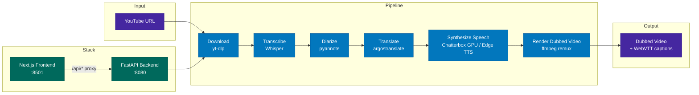

# Foreign Whispers

[](./LICENSE)

> **NYU Spring 2026 — NLP Project**  
> **Student:** Tilak Bhansali &nbsp;|&nbsp; **NetID:** `tb3057`

YouTube video dubbing pipeline — transcribe, translate, and dub videos into Spanish with gender-aware neural voices.

---

## 🎬 Demo

| | Link |
|---|---|
| **Screen Recording (Pipeline Demo)** | _TODO: Add YouTube/GDrive link_ |
| **Sample Output Video** | _TODO: Add YouTube/GDrive link_ |

---

## Architecture



---

## Quick Start

### Mac (Apple Silicon / Intel) — CPU Profile

```bash
git clone https://github.com/tilak30/foreign-whispers.git
cd foreign-whispers

# Copy env template (no changes needed for basic use)
cp .env.example .env

# Start all services (no GPU required)
docker compose --profile cpu up -d

# Open the UI
open http://localhost:8501
```

TTS uses **Microsoft Edge TTS** (free, neural, gender-aware) by default — no API key needed.  
For GPU-accelerated Chatterbox voice cloning, see [GPU Setup](#gpu-setup) below.

### NVIDIA GPU

```bash
docker compose --profile nvidia up -d
```

### Apple Silicon GPU (experimental)

```bash
docker compose --profile apple up -d
```

---

## Pipeline Stages

| Stage | What it does | Output |
|-------|-------------|--------|
| **Download** | Fetch video + captions from YouTube via yt-dlp | `videos/`, `youtube_captions/` |
| **Transcribe** | Speech-to-text via Whisper (`faster-whisper-medium`) | `transcriptions/whisper/` |
| **Diarize** | Speaker turn detection via pyannote.audio | injected into transcript JSON |
| **Translate** | EN→ES via argostranslate (offline OpenNMT) + neural reranking | `translations/argos/` |
| **Synthesize Speech** | Gender-aware neural TTS, time-aligned to original segments | `tts_audio/chatterbox/` |
| **Render Dubbed Video** | Replace audio track via ffmpeg remux (no re-encoding) | `dubbed_videos/` |

### TTS Engine Priority

The system selects the best available engine automatically:

1. **Chatterbox GPU** — best quality, voice cloning, requires GPU server
2. **Edge TTS** _(default local fallback)_ — Microsoft neural voices, free, gender-aware:
   - Male: `es-ES-AlvaroNeural`
   - Female: `es-ES-ElviraNeural`
3. **Coqui Tacotron2** — offline fallback, no internet required

Force a specific engine via `FW_TTS_ENGINE` env var:

```bash
FW_TTS_ENGINE=edge    # Microsoft neural (default when no GPU)
FW_TTS_ENGINE=coqui   # Offline Coqui
```

---

## GPU Setup

### Colab Backend (Chatterbox)

1. Open `colab_backend.ipynb` on [Google Colab](https://colab.research.google.com)
2. Set Runtime → **T4 GPU**
3. Run the single cell — it prints a public URL
4. Add to `.env`: `API_URL=https://xxxx.ngrok-free.app`
5. Restart: `docker compose --profile cpu up -d`

### Speaker Voice Files

Place reference WAV clips in `pipeline_data/speakers/` for voice cloning:

```
pipeline_data/speakers/
├── default.wav          # Fallback voice
└── es/
    └── default.wav      # Spanish fallback
```

The pipeline maps speaker IDs (from pyannote diarization) to reference WAVs round-robin.

---

## Project Structure

```
foreign-whispers/
├── api/src/                     # FastAPI backend (layered architecture)
│   ├── main.py                  # App factory + lazy model loading
│   ├── core/config.py           # Pydantic settings (FW_ env prefix)
│   ├── routers/                 # Thin route handlers
│   │   ├── download.py          # POST /api/download
│   │   ├── transcribe.py        # POST /api/transcribe/{id}
│   │   ├── translate.py         # POST /api/translate/{id}
│   │   ├── tts.py               # POST /api/tts/{id}
│   │   └── stitch.py            # POST /api/stitch/{id}
│   ├── services/                # Business logic (HTTP-agnostic)
│   │   ├── tts_engine.py        # Chatterbox / EdgeTTS / Coqui backends
│   │   └── tts_service.py       # Service wrapper
│   └── schemas/                 # Pydantic request/response models
├── foreign_whispers/            # Core library (importable without Docker)
│   ├── reranking.py             # Neural translation reranking (Argos + MarianMT)
│   ├── alignment.py             # Ridge regression duration prediction + DP alignment
│   └── diarization.py          # pyannote speaker diarization
├── frontend/                    # Next.js + shadcn/ui Dubbing Studio
├── pipeline_data/               # All intermediate and output files (volume-mounted)
│   └── api/
│       ├── videos/              # Downloaded source MP4s
│       ├── transcriptions/whisper/
│       ├── translations/argos/
│       ├── tts_audio/chatterbox/
│       ├── dubbed_videos/
│       └── speakers/            # Reference voice WAV clips
├── docker-compose.yml           # Profiles: nvidia, cpu, apple
├── Dockerfile                   # Multi-stage: cpu and gpu targets
├── colab_backend.ipynb          # Single-cell Colab GPU server
└── REPORT.md                    # Technical report
```

## API Endpoints

| Method | Endpoint | Description |
|--------|----------|-------------|
| POST | `/api/download` | Download YouTube video + captions |
| POST | `/api/transcribe/{id}` | Whisper speech-to-text |
| POST | `/api/translate/{id}` | EN→ES translation |
| POST | `/api/tts/{id}` | Time-aligned TTS synthesis |
| POST | `/api/stitch/{id}` | Audio remux (ffmpeg -c:v copy) |
| GET | `/api/video/{id}` | Stream dubbed video |
| GET | `/api/captions/{id}` | Translated WebVTT captions |
| GET | `/healthz` | Health check |

## Development

### Editing the library (no rebuild needed)

The `foreign_whispers/` and `api/` directories are **bind-mounted** into the API container. Edit on host, restart API to pick up changes:

```bash
docker compose --profile cpu restart api
```

Or add `--reload` to uvicorn in `docker-compose.yml` for auto-restart.

### Running tests

```bash
uv run pytest tests/ -q -k "not requires_pyannote and not requires_silero"
```

### Environment variables

| Variable | Default | Description |
|---|---|---|
| `FW_TTS_ENGINE` | _(auto)_ | Force `edge`, `coqui`, or `chatterbox` |
| `FW_EDGE_VOICE_MALE` | `es-ES-AlvaroNeural` | Edge TTS male voice |
| `FW_EDGE_VOICE_FEMALE` | `es-ES-ElviraNeural` | Edge TTS female voice |
| `FW_ALIGNMENT` | `on` | Set `off` to disable ridge-regression alignment |
| `FW_TTS_WORKERS` | `3` | Concurrent TTS synthesis threads |
| `CHATTERBOX_API_URL` | `http://localhost:8020` | Chatterbox GPU server URL |

### Requirements

- Docker + Docker Compose
- ffmpeg (system-wide, for video remux)
- Python 3.11+ (for local library use without Docker)
- NVIDIA GPU or Google Colab T4 recommended for Chatterbox voice cloning
